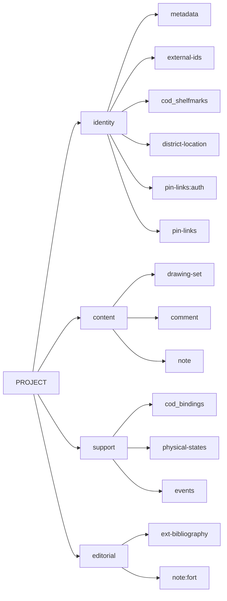
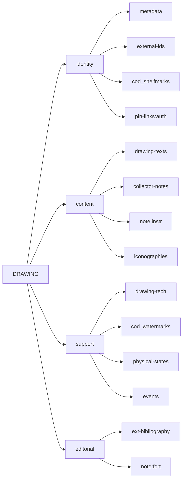

# Cadmus NDP Drawings

- [Cadmus models reference](https://myrmex.github.io/overview/cadmus/dev/models/)
- [Cadmus bricks playground](https://cadmus-bricks.fusi-soft.com/)
- [Cadmus NDP FRAC](https://github.com/vedph/cadmus-ndp-frac)
- [Cadmus NDP Books](https://github.com/vedph/cadmus-ndp-books)

In what follows:

- 🟢 marks a [general](https://vedph.github.io/cadmus-doc/models/shared.html#general) or bibliographic part.
- 📖 marks a [codicology](https://vedph.github.io/cadmus-doc/models/shared.html#codicology) part.
- ⭐ marks a new part. The star is used once, even when that part is then reused in other items. If a part marked with a star has a link to documentation, this means that I have already implemented it as I could do this in advance for generic parts. All the other parts are still to be implemented.
- ⚠️ marks an area where the model must still be defined with a discussion.

## New Parts

### DrawingSetPart

A set of drawings belonging to a single project.

- ⭐ `DrawingSetPart`:
  - `material` (📚 `drawing-set-materials`)
  - `bound` (`string` 📚 `drawing-set-bindings`): bound sheets, once bound sheets, etc.
  - [decorated counts brick](https://github.com/vedph/cadmus-bricks-shell-v3/blob/master/projects/myrmidon/cadmus-refs-decorated-counts/README.md) (📚 `drawing-set-counts-ids`, 📚 `drawing-set-counts-tags`)
  - `features` (`string[]` 📚 `drawing-set-features`)
  - `targets` (`DrawingSetTarget[]`):
    - `citation` (`string`, via brick)
    - `missing` (`boolean`, when any is true, the project is not complete)
  - `note` (`string`)

### DrawingTechPart

Technical description of a drawing: material and techniques.

- ⭐ `DrawingTechPart`:
  - `material` (📚 `drawing-tech-materials`)
  - `note` (`string`)
  - `features` (📚 `drawing-tech-features`)
  - [measurements brick](https://github.com/vedph/cadmus-bricks-shell-v3/tree/master/projects/myrmidon/cadmus-mat-physical-size#physicalmeasurementset) (📚 `drawing-tech-size-units`, 📚 `drawing-tech-dim-tags`, 📚 `drawing-tech-set-names`)
  - `techniques` (`string[]` flags: 📚 `drawing-tech-techniques`)
  - `watercolors` (`string[]` flags: 📚 `drawing-tech-watercolors`); if any is present then "acquerellature" is implied.

### DrawingTextsPart

- ⭐ `DrawingTextsPart`:
  - `texts` (`DrawingText[]`):
    - `type`\* (📚 `drawing-texts-types`: text, comment, other...)
    - `citation` (`string`, via brick)
    - `script` (📚 `drawing-texts-scripts`)
    - `value` (`string`)
    - `author` (`AssertedId[]` see [AssertedCompositeId](https://github.com/vedph/cadmus-bricks-shell-v3/blob/master/projects/myrmidon/cadmus-refs-asserted-ids/README.md#asserted-composite-id)): `tag` can be used for his role (stesso autore disegno etc).
    - `date` ([HistoricalDate](https://github.com/vedph/cadmus-bricks-shell-v3/blob/master/projects/myrmidon/cadmus-refs-historical-date/README.md))

### IconographiesPart

- ⭐ `IconographiesPart`:
  - `iconographies` (`Iconography[]`):
    - `eid` (`string`)
    - `subjects`\* (`string[]` 📚 `iconography-macro-subjects`, categories tree)
    - `description` (`string`, MD, 5000)
    - `relCitations` (`IcoRelCitation[]`):
      - `citations`\* (`string[]` via citation brick)
      - `tag` (`string`, 📚 `iconography-cit-tags`)
      - `note` (`string`, 1000)
    - `relTexts` (`IcoRelText[]`):
      - `type`\* (`string` 📚 `iconography-txt-types`)
      - `tag` (`string` 📚 `iconography-txt-tags`)
      - `language`\* (`string` 📚 `iconography-txt-languages`)
      - `value` (`string`)
      - `note` (`string`, 1000)
    - `features` (`string[]` flags: 📚 `iconography-features`): storie prime/seconde, etc.
    - `contexts`  (`string[]`, 📚 `iconography-context-links`, categories tree): luoghi danteschi etc.
    - `links` (`AssertedId[]`; see [AssertedCompositeIds](https://github.com/vedph/cadmus-bricks-shell-v3/blob/master/projects/myrmidon/cadmus-refs-asserted-ids/README.md#asserted-composite-ids)): to mss etc.
    - `note` (`string`, 1000)
    - `keywords` (`Keyword[]`):
      - `language`\* (`string` 📚 `iconography-key-languages`)
      - `value`\* (`string`)

## Project Item

- identity:
  - 🟢 [MetadataPart](https://github.com/vedph/cadmus-general/blob/master/docs/metadata.md)
  - 🟢 [ExternalIdsPart](https://github.com/vedph/cadmus-general/blob/master/docs/external-ids.md)
  - 📖 [CodShelfmarksPart](https://github.com/vedph/cadmus-codicology/blob/master/docs/cod-shelfmarks.md)
  - 🟢 [DistrictLocationPart](https://github.com/vedph/cadmus-general/blob/master/docs/district-location.md) for production area
  - 🟢 [PinLinksPart](https://github.com/vedph/cadmus-general/blob/master/docs/fr.pin-links.md):`auth` for authors. This has label, gid, scope, tag, assertion for each author.
  - 🟢 [PinLinksPart](https://github.com/vedph/cadmus-general/blob/master/docs/fr.pin-links.md) for links to other items like mss etc.

- content:
  - ⭐ [DrawingSetPart](#drawingsetpart)
  - 🟢 [CommentPart](https://github.com/vedph/cadmus-general/blob/master/docs/comment.md) for description
  - 🟢 [NotePart](https://github.com/vedph/cadmus-general/blob/master/docs/note.md)

- support:
  - 📖 [CodBindingsPart](https://github.com/vedph/cadmus-codicology/blob/master/docs/cod-bindings.md)
  - 🟢 [PhysicalStatesPart](https://github.com/vedph/cadmus-general/blob/master/docs/physical-states.md): type, features, date, note
  - 🟢 [HistoricalEventsPart](https://github.com/vedph/cadmus-general/blob/master/docs/historical-events.md)

- editorial:
  - 🟢 [ExtBibliographyPart](https://github.com/vedph/cadmus-general/blob/master/docs/ext-bibliography.md)
  - 🟢 [NotePart](https://github.com/vedph/cadmus-general/blob/master/docs/note.md):`fort`: "fortuna critica".

## Drawing Item

Each drawing belongs to a project via its group ID.

- identity:
  - 🟢 [MetadataPart](https://github.com/vedph/cadmus-general/blob/master/docs/metadata.md)
  - 🟢 [ExternalIdsPart](https://github.com/vedph/cadmus-general/blob/master/docs/external-ids.md)
  - 📖 [CodShelfmarksPart](https://github.com/vedph/cadmus-codicology/blob/master/docs/cod-shelfmarks.md)
  - [PinLinksPart](https://github.com/vedph/cadmus-general/blob/master/docs/fr.pin-links.md):`auth` for authors.
- content:
  - ⭐ [DrawingTextsPart](#drawingtextspart)
  - ⭐ [CodEditsPart](https://github.com/vedph/cadmus-codicology/blob/master/docs/cod-edits.md): note collezione
  - 📖 [IconographicInstructionsPart](https://github.com/vedph/cadmus-codicology/blob/master/docs/cod-illum-instructions.md)
  - ⭐ [IconographiesPart](#iconographiespart)
- support:
  - ⭐ [DrawingTechPart](#drawingtechpart)
  - 📖 [CodWatermarksPart](https://github.com/vedph/cadmus-codicology/blob/master/docs/cod-watermarks.md)
  - 🟢 [PhysicalStatesPart](https://github.com/vedph/cadmus-general/blob/master/docs/physical-states.md): type, features, date, note
  - 🟢 [HistoricalEventsPart](https://github.com/vedph/cadmus-general/blob/master/docs/historical-events.md)
- editorial:
  - 🟢 [ExtBibliographyPart](https://github.com/vedph/cadmus-general/blob/master/docs/ext-bibliography.md)
  - 🟢 [NotePart](https://github.com/vedph/cadmus-general/blob/master/docs/note.md):`fort`: "fortuna critica".
